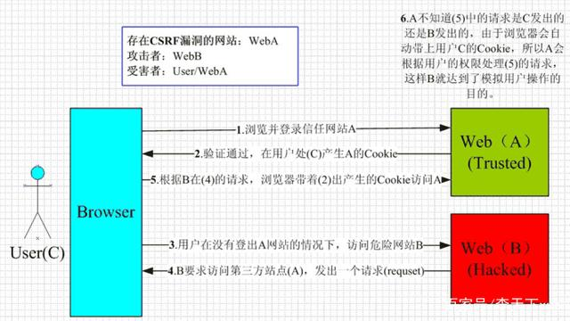

# web安全之xss和csrf

## 什么是xss攻击
> xss， Cross Site Script，即跨站脚本攻击。
### 攻击原理
&emsp;&emsp;攻击者对客户端网页注入的恶意脚本一般包括 JavaScript，有时也会包含 HTML 和 Flash。有很多种方式进行 XSS 攻击，但它们的共同点为：将一些隐私数据像 cookie、session 发送给攻击者，将受害者重定向到一个由攻击者控制的网站，在受害者的机器上进行一些恶意操作。
### 攻击方式
&emsp;&emsp;一般有三类：
* 反射型：
> &emsp;&emsp;反射型 XSS 只是简单地把用户输入的数据 “反射” 给浏览器，这种攻击方式往往需要攻击者诱使用户点击一个恶意链接，或者提交一个表单，或者进入一个恶意网站时，注入脚本进入被攻击者的网站。攻击者可以注入任意的恶意脚本进行攻击，可能注入恶作剧脚本，或者注入能获取用户隐私数据(如cookie)的脚本，这取决于攻击者的目的。

* 存储型
>&emsp;&emsp;存储型 XSS 会把用户输入的数据 “存储” 在服务器端，当浏览器请求数据时，脚本从服务器上传回并执行。这种 XSS 攻击具有很强的稳定性。
>
>&emsp;&emsp;比较常见的一个场景是攻击者在社区或论坛上写下一篇包含恶意 JavaScript 代码的文章或评论，文章或评论发表后，所有访问该文章或评论的用户，都会在他们的浏览器中执行这段恶意的 JavaScript 代码。

* 基于DOM
> &emsp; &emsp;基于 DOM 的 XSS 攻击是指通过恶意脚本修改页面的 DOM 结构，是纯粹发生在客户端的攻击。
>如下面例子：
>```html
><h2>XSS: </h2>
><input type="text" id="input">
><button id="btn">Submit</button>
><div id="div"></div>
><script>
>    const input = document.getElementById('input');
>    const btn = document.getElementById('btn');
>    const div = document.getElementById('div');
>    let val;
>    input.addEventListener('change', (e) => {
>        val = e.target.value;
>    }, false);
>    }, false);
>    btn.addEventListener('click', () => {
>        div.innerHTML = `<a href=${val}>testLink</a>`
>    }, false);
></script>
>```
>点击 Submit 按钮后，会在当前页面插入一个链接，其地址为用户的输入内容。如果用户在输入时构造了如下内容：
>```javascript 
>'' onclick=alert(/xss/)
>```
>用户提交之后，页面代码就变成了：
>```html
><a href onlick="alert(/xss/)">testLink</a>
>```
>此时，用户点击生成的链接，就会执行对应的脚本。

## xss攻击的防范
* CSP
> &emsp;&emsp;现在主流的浏览器内置了防范XSS的措施，例如CSP。内容安全策略 (CSP, Content Security Policy) 是一个附加的安全层，用于帮助检测和缓解某些类型的攻击，包括跨站脚本攻击 (XSS) 和数据注入等攻击。

> &emsp;&emsp;如何应用：
  >CSP 可以由两种方式指定：HTTP Header 和 HTML。HTTP 是在 HTTP 由增加 Header 来指定，而 HTML 级别则由 Meta 标签指定。
>
>1. meta设置：
>
>```html
><meta http-equiv="Content-Security-Policy" content="CSP指令">
>```
>http响应头设置
>```javascript
>    response: {
>        Content-Security-Policy: "CSP指令"
>    }
>```

&emsp;&emsp;Meta 标签与 HTTP 头只是行式不同而作用是一致的。与 HTTP 头一样，优先采用最先定义的策略。如果 HTTP 头与 Meta 定义同时存在，则优先采用 HTTP 中的定义。

&emsp;&emsp;&emsp如果用户浏览器已经为当前文档执行了一个 CSP 的策略，则会跳过 Meta 的定义。如果 META 标签缺少 content 属性也同样会跳过。

&emsp;&emsp;&emsp针对开发者草案中特别的提示一点：为了使用策略生效，应该将 Meta 元素头放在开始位置，以防止提高人为的 CSP 策略注入。

* 输入检查
>&emsp;&emsp;不要相信用户的任何输入。 对于用户的任何输入要进行检查、过滤和转义。建立可信任的字符和 HTML 标签白名单，对于不在白名单之列的字符或者标签进行过滤或编码。
>
>&emsp;&emsp;在 XSS 防御中，输入检查一般是检查用户输入的数据中是否包含 <，> 等特殊字符，如果存在，则对特殊字符进行过滤或编码，这种方式也称为 XSS Filter。
>
>&emsp;&emsp;而在一些前端框架中，都会有一份 decodingMap， 用于对用户输入所包含的特殊字符或标签进行编码或过滤，如 <，>，script，防止 XSS 攻击：
>
>```javascript
>// vuejs 中的 decodingMap
>// 在 vuejs 中，如果输入带 script 标签的内容，会直接过滤掉
>const decodingMap = {
>  '&lt;': '<',
>  '&gt;': '>',
>  '&quot;': '"',
>  '&amp;': '&',
>  '
>  ': '\n'
>}
>```

* 输出检查
>用户的输入会存在问题，服务端的输出也会存在问题。一般来说，除富文本的输出外，在变量输出到 HTML 页面时，可以使用编码或转义的方式来防御 XSS 攻击。例如利用 sanitize-html 对输出内容进行有规则的过滤之后再输出到页面中。

## 什么是CSRF攻击
>&emsp;&emsp;CSRF，即 Cross Site Request Forgery，中译是跨站请求伪造，是一种劫持受信任用户向服务器发送非预期请求的攻击方式。
>
>&emsp;&emsp;通常情况下，CSRF 攻击是攻击者借助受害者的 Cookie 骗取服务器的信任，可以在受害者毫不知情的情况下以受害者名义伪造请求发送给受攻击服务器，从而在并未授权的情况下执行在权限保护之下的操作。
### 攻击原理和方式:


csrf：跨站请求伪造
原理：在登陆了b网站之后，没退出，然后去访问其他的危险网站或者点击不安全连接。不需要获取到你的的cookie，但是可以使用你的身份去操作

### 如何防范CSRF
* 验证码
>&emsp;&emsp;验证码被认为是对抗 CSRF 攻击最简洁而有效的防御方法。CSRF 攻击往往是在用户不知情的情况下构造了网络请求。而验证码会强制用户必须与应用进行交互，才能完成最终请求。因为通常情况下，验证码能够很好地遏制 CSRF 攻击。但是会带来不好的用户体验。

*  Referer Check
>&emsp;&emsp;根据 HTTP 协议，在 HTTP 头中有一个字段叫 Referer，它记录了该 HTTP 请求的来源地址。通过 Referer Check，可以检查请求是否来自合法的”源”。

* 添加 token 验证(token==令牌)
>&emsp;&emsp;CSRF 攻击之所以能够成功，是因为攻击者可以完全伪造用户的请求，该请求中所有的用户验证信息都是存在于 Cookie 中，因此攻击者可以在不知道这些验证信息的情况下直接利用用户自己的 Cookie 来通过安全验证。要抵御 CSRF，关键在于在请求中放入攻击者所不能伪造的信息，并且该信息不存在于 Cookie 之中。可以在 HTTP 请求中以参数的形式加入一个随机产生的 token，并在服务器端建立一个拦截器来验证这个 token，如果请求中没有 token 或者 token 内容不正确，则认为可能是 CSRF 攻击而拒绝该请求。


## 误区：不能使用以下两种方式去防御csrf

* 1、使用post防御：

&emsp;&emsp;一般都是我们看到的csrf攻击的例子，都是使用通过加载一张图片,触发请求里面的src连接来进行get请求操作或者通过一个恶意连接的点击，在用户不知情的情况下进行操作。其实也是可以通过post请求来实现攻击。在页面上注入如下代码就可以实现post请求进行攻击操作：
```javascript
<body onload="document.forms[0].submit()">
    <form action="xxxx" method="POST">
        <input type="hidden" name="amount" value="1500">
        <input type="hidden" name="destinationAccount" value="123456789">
    </form>
</body>
```

* 2、使用https进行防御：https其实就是 http层+ssl层 ，https的封装其实就是将http的内容交给ssl层加密之后，再有ssl层传递给传输层，入如此下去而已，而csrf是在http层设置的，所以https是无法防御的。